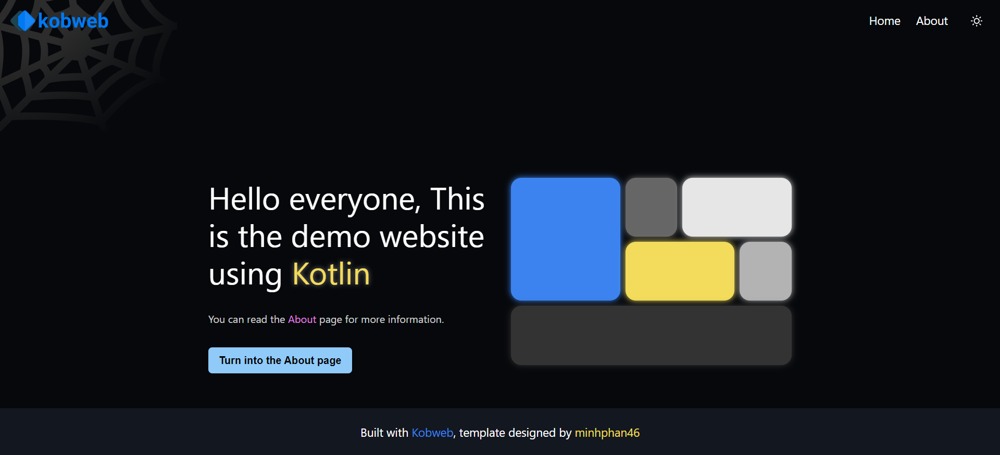

This is a [Kobweb](https://github.com/varabyte/kobweb) project bootstrapped with the `app` template.

## Getting Started

First, run the development server by typing the following command in a terminal under the `site` folder:

```bash
$ cd site
$ kobweb run
```

Open [http://localhost:8080](http://localhost:8080) with your browser to see the result.

You can use any editor you want for the project, but we recommend using **IntelliJ IDEA Community Edition** downloaded
using the [Toolbox App](https://www.jetbrains.com/toolbox-app/).

Press `Q` in the terminal to gracefully stop the server.

## Navigating the Project

This simple project has a couple of example files you can learn from. The following list is not exhaustive but should
help you get started finding your way around this relatively small example project:

* `AppEntry.kt`<br>
  This is the entry-point composable called for ALL pages. Note that the method is annotated with `@App` which is how
  Kobweb discovers it (the file name and method name don't matter). You will not have to call this composable anywhere
  in your site, as this is handled automatically by the framework.
* `SiteTheme.kt`<br>
  An example of one approach to extend the theme provided by Silk with your own site-specific colors.
* `components/layout/PageLayout.kt`<br>
  An example layout which, unlike `AppEntry`, won't get called automatically.
  Instead, this is a recommended way to organize your high level, shared, layout composables. It is expected that most
  pages on your site will share the same layout, but you can create others if different pages have different
  requirements. You can find this layout referenced in `pages/Index.kt`.
* `components/layout/MarkdownLayout.kt`<br>
  Additional layout configuration useful for pages generated by markdown. This layout builds on top of `PageLayout`
  to extend it, which can be a useful pattern in your own site. You can find this layout is referenced in
  `markdown/About.md`.
* `components/sections/NavHeader.kt`<br>
  An example of a re-usable composable section. In this case, users will feel that the nav header lives across all
  pages, but actually, it's a section shared by them and re-rendered separately per page.
* `pages/Index.kt`<br>
  The top level page, which will get rendered if the user visits `(yoursite.com)/` (the name
  `index` means it will be a special page that gets visited by default when no explicit page is specified). Note that
  the composable is annotated with `@Page` which is how `Kobweb` discovers it.
* `resources/markdown/About.md`<br>
  A markdown file which gets converted into a page for you automatically at compile
  time. This page will get rendered if the user visits `(yoursite.com)/about` If you are writing a blog, it can be
  very convenient to write many of your posts using markdown instead of Kotlin code.

### Live Reload

While Kobweb is running, fuel free to modify the code! When you make any changes, Kobweb will notice this
automatically, and the site will indicate the status of the build and automatically reload when ready.

## Exporting the Project

When you are ready to ship, you should shutdown the development server and then export the project using:

```bash
$ kobweb export --layout static
```

When finished, you can run a Kobweb server in production mode to test it.

```bash
$ kobweb run --env prod --layout static
```

The above export generates a layout which is compatible with any static hosting provider of your choice, such as
GitHub Pages, Netlify, Firebase, etc. There is also a more powerful export option to create a fullstack server,
but as the additional power provided by that approach is not needed by most users and comes with more expensive
hosting costs, it is not demonstrated in this project.

You can read more about static layouts here: https://bitspittle.dev/blog/2022/staticdeploy

You can read more about fullstack layouts here: https://bitspittle.dev/blog/2023/clouddeploy